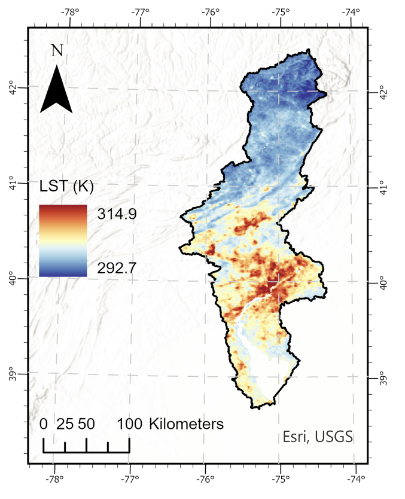
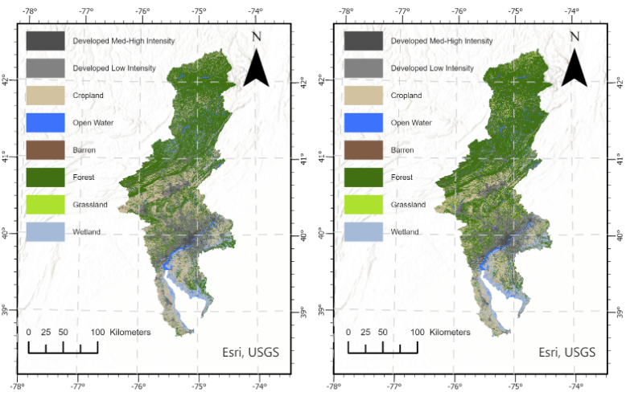
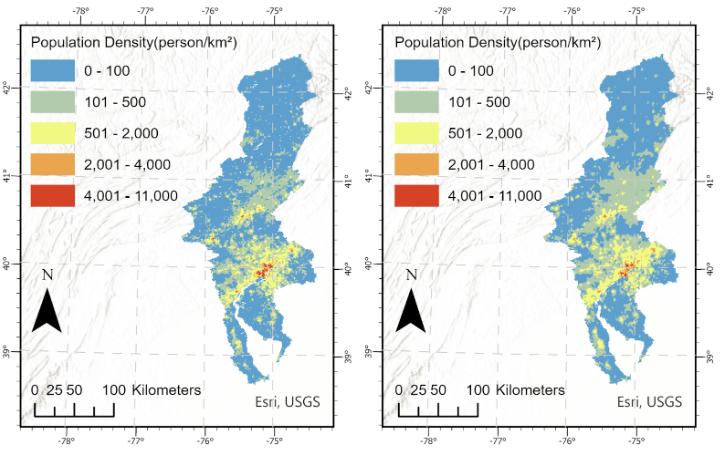
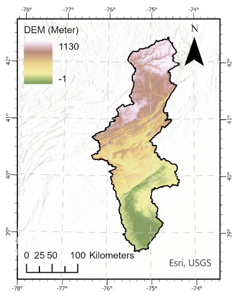

# The LST predict of Delaware River Basin: An OLS based scenario analysis on climatic-socioeconomic policies  
In the context of global warming, risk assessment has become the focus of urban heat island effect research, because the risk level of urban heat island effect will affect the urban policy layout. In this paper, we choose land use type (LULC), digital elevation data (DEM), population density (POP) as independent variables, and land surface temperature (LST) as a dependent variable. Then we use OLS and random forest for modeling. Finally, we choose an OLS model with a good fitting degree to predict and evaluate the future risk. The results show that. Our research results provide a forward-looking perspective, so as to provide a certain reference for the future urban policy layout.
## Study area 
The Delaware River Basin was selected for this study due to its critical role as an economic hub and a key regional water supply. This area is particularly relevant for examining the impact of 21st-century climate change, as it is projected to experience significant warming, with temperatures rising 1–5 °C by the century's end, especially in winter and summer.
## Data Collection  
1. Create an 1km fishnet within Delaware River Basin  
A 1 kilometer fishnet within Delaware River Basin is created for zonal statistical analysis and producing dataframe including all features later.
2. LST  
Land Surface Temperature 8-Day data derived from the Moderate-Resolution Imaging Spectroradiometer (MODIS) was downloaded from NASA (https://ladsweb.modaps.eosdis.nasa.gov/). The spatial resolution is 1 km. Areas where QC > 3 K were eliminated.LST in summer (June to August) of 2005,2010,2015and 2020 was synthesized to obtain the average LST in summer of these 4 years. 

3. Land Use Data  

The historical land use data is derived from National Land Cover Database from EROS (https://www.sciencebase.gov/catalog/item/6345b637d34e342aee0863aa). The 2010 land use data and predicted land use data under SSPs are from Dornbierer et al.(2021)[1] The original data is of 30-meter resolution. The data is transformed to projected coordinate and reclassified to 8 classes specified as table 1. Then, using the fishnet as feature zone input and land use data as feature class input to perform a tabulate area. The area of each land use class within grids of the fishnet is calculated and exported as a table. Since we mainly study urban area data, we remove places where Developed Low Intensity and Developed Med-High Intensity areas account for less than 40%. 

<table align="center">
<tbody>
<tr>
<td align="center"><strong>Class Number</strong></td>
<td align="center"><strong>Land Use Type</strong></td>
</tr>
<tr>
<td align="center">1</td>
<td align="center">Cropland</td>
</tr>
<tr>
<td align="center">2</td>
<td align="center">Open Water</td>
</tr>
<tr>
<td align="center">3</td>
<td align="center">Developed Low Intensity</td>
</tr>
<tr>
<td align="center">4</td>
<td align="center">Developed Med-High Intensity</td>
</tr>
<tr>
<td align="center">5</td>
<td align="center">Barren</td>
</tr>
<tr>
<td align="center">6</td>
<td align="center">Forest，Shrubland</td>
</tr>
<tr>
<td align="center">7</td>
<td align="center">Grassland / Pasture</td>
</tr>
<tr>
<td align="center">8</td>
<td align="center">Wetlands</td>
</tr>
</tbody></table>

4. Population data    

Historical population count data is from WorldPop (www.worldpop.org/). The predicted population count data under various Shared Socioeconomic Pathways (SSPs) published by Li et al.[2] is produced based on WorldPop data.
With the raster images projected to the same projected coordinate as land use data, the images are then processed through zonal statistics as table tool using ArcGIS Pro. Result table shows the total population count within a grid.
5. DEM data  
3DEP DEM dataset is downloaded via Google Earth Engine (https://developers.google.com). It is reprojected and the average elevation of each grid is calculated through zonal statistics as a table.

# Quick Start
```cmd
git clone https://github.com/ChelseaLiu0822/NYCUHI.git
cd NYCUHI
git branch --show-current % see the current branch%
git checkout -b dev origin/dev % if it is not dev%
```

